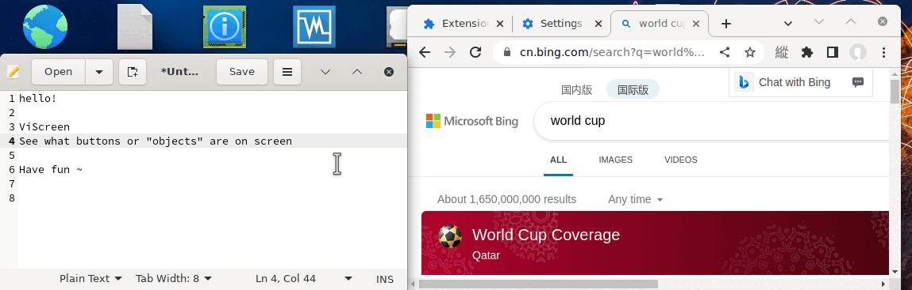

Let's do some tries to dump traditional mouse

# viScreenMouse

Use keyboard to click anywhere of screen. OpenCV based screenshot visual recognition. 

> The **vi** in the name here can mean "Vim", "Vision-recognition" or whatever

Dependencies:

- python3 and: opencv , qt5 , pillow , numpy , pynput

Theoretically works cross-platform. Tested on Linux X11 and Windows.

This is still very simple and **in alpha preview** stage currently. Anything could need or be rewritten and changed.

## Usage

1. Hit `ctrl + meta` to find clickable objects on screen and show keys (meta key = win key = super key)
2. Press some keys to move mouse to that position
3. It triggers click (if `autoClick=True`. Otherwise hit `meta + ctrl` to trigger click)

> Open the file and configure for your need: whole screen, autoClick ...

There're some known issues. Apparently there're many we can do to improve it (open for discussion) :

- Algorithm (filtering, recognizing,  parameters... ) . Currently, if you don't have a high contrast GUI, or some icons or buttons don't have clear contour, or two objects too close,  it may fail to recognize.

- It's better to make it faster when using hi-res full-screens (in the future will apply grid selecting)

## Other vi / keybinding projects

Keyboard clicking:

- [hunt-and-peck](https://github.com/zsims/hunt-and-peck) Simple vimium/vimperator style navigation for Windows applications based on the UI Automation framework.

- [vimac](https://github.com/dexterleng/vimac) keyboard-driven navigation and control of the macOS Graphical User Interface (GUI)

- [vimium-everywhere](https://github.com/phil294/vimium-everywhere) OS-wide Keyboard navigation for Linux and Windows

- [keynav](https://github.com/jordansissel/keynav) Control the mouse with the keyboard. only works on X11

- [Vimperator](https://github.com/vimperator/vimperator-labs) (discontinued) Make Firefox/Thunderbird look and behave like Vim

- [vimkey](https://github.com/Haojen/vimkey) Browser extension. Use the keyboard trigger click button or open a link

- [Vimium](https://github.com/philc/vimium) browser extension that provides keyboard-based navigation and control of the web in the spirit of the Vim editor.

- [Vimium C](https://github.com/gdh1995/vimium-c) A Customized Vimium having contextual mapping, global shortcuts, command sequences

- [Big Search](https://github.com/garywill/BigSearch) A multiple-search-engine browser extension that has keyboard clicking feature on its UI

Edit text using vi-like keybinding on non-vi app:

- [gtk-vikb](https://github.com/polachok/gtk-vikb) (discontinued) add vi keybindings to gtk (2/3) text areas
- [Firenvim](https://github.com/glacambre/firenvim) Turn browser <textarea> into a Neovim client
- [wasavi](https://github.com/akahuku/wasavi) Transforms browser <textarea> into a VI editor
- [emacs-anywhere](https://github.com/zachcurry/emacs-anywhere)
- [Emacs Everywhere](https://github.com/tecosaur/emacs-everywhere)
- [vime](https://github.com/algon-320/vime) Using Vim as an input method editor for X11 applications
- [vim_ahk](https://github.com/rcmdnk/vim_ahk) Based on AutoHotKey
- [tsf-vim](https://github.com/deton/tsf-vim) (discontinued) Windows IME to edit text like vim editor
